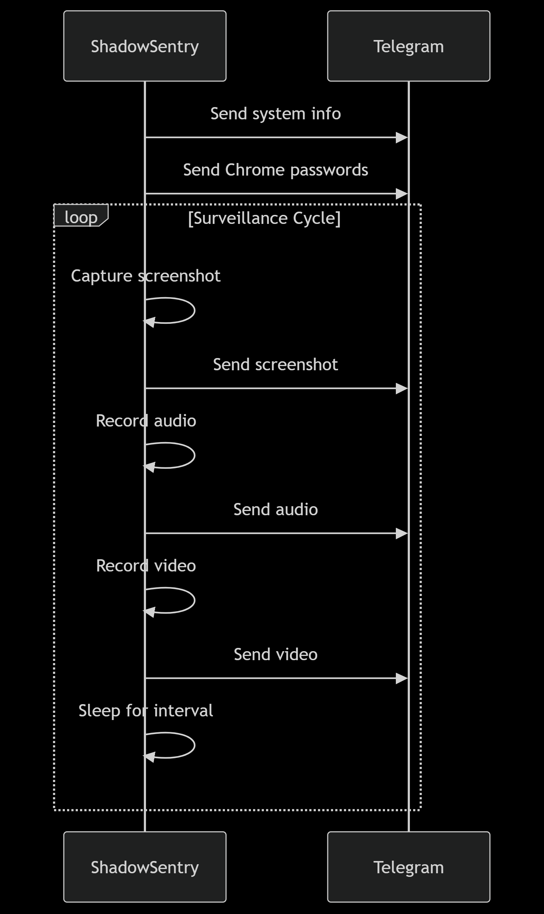

# Spyware-pegasus-version1   (🕵️‍♂️ ShadowSentry)

Python
License
Platform
Version

ShadowSentry spyware is a sophisticated ethical hacking system monitoring tool designed for comprehensive surveillance and data collection. It operates stealthily to capture system information, credentials, media, and environmental data, transmitting everything securely to a Telegram bot.

🌟 Features

📸 Media Capture

Screenshot Automation: High-resolution screenshots at regular intervals

Audio Recording: Ambient sound capture with configurable duration

Video Surveillance: Webcam footage recording with MP4 encoding

🔒 Credential Extraction

Chrome password decryption with AES-GCM

Automatic retry mechanism for locked databases

Secure transmission in chunks to bypass message limits

📊 System Intelligence

Comprehensive system information collection

Chunked transmission for large data payloads

Real-time status updates via Telegram

🔐 Security Features

Fernet-encrypted configuration

Secure credential handling

Error-resistant design with comprehensive logging

🛠️ Technical Architecture
Diagram

⚙️ Installation

Prerequisites:

pip install -r requirements.txt

Required packages:

pyautogui

pandas

pywin32

sounddevice

opencv-python

cryptography

requests

Configuration:

Replace the Fernet key in encryption_key

Update encrypted_bot_token and encrypted_chat_id with your Telegram credentials

Customize capture durations in the function calls

🚀 Usage

python tiktok.py

The script will:

Initialize secure communication channels

Create necessary directories (img/, audio/)

Begin automated surveillance cycle:

System information collection

Credential extraction

Periodic media capture

🔄 Operation Cycle
Diagram

🛡️ Security Considerations

All sensitive data is encrypted with AES-256

Telegram communication uses HTTPS

Memory-safe operations for credential handling

Automatic cleanup of temporary files

📜 License

This project is licensed under the MIT License - see the LICENSE file for details.

💌 Contact
For ethical use inquiries or security concerns:

williamkitungo@gmail.com

Warning: This tool is intended for authorized penetration testing and educational purposes only. Unauthorized use against systems you don't own or have permission to test is illegal.

🕶️ Keep it stealthy, keep it ethical.
Made with ❤️ (and a bit of 😈) by illusivehacks
